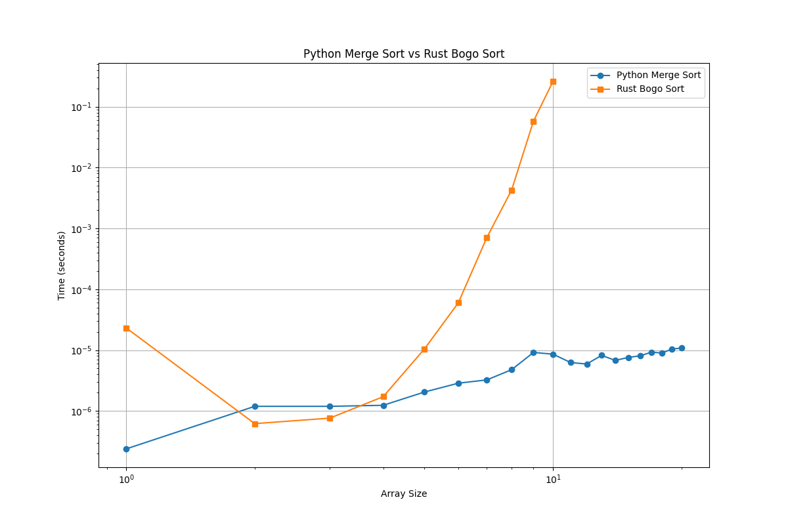

# Python Merge Sort vs Rust Bogo Sort Comparison

This project compares the performance of merge sort implemented in Python against bogo sort implemented in Rust. The goal is to find the array length at which Python's merge sort becomes faster than Rust's bogo sort.

## Setup

1. Clone the repository:
   ```bash
   git clone https://github.com/henri123lemoine/sorting-comparison.git
   cd sorting-comparison
   ```

2. Build the Rust library:
   ```bash
   cargo build --release
   cd ../..
   ```

## Running the Benchmark

To run the benchmark and find the crossover point:

```bash
./benchmark.sh
```

This script will test various array lengths and report the point at which Python's merge sort becomes faster than Rust's bogo sort.

## Project Structure

- `src/merge_sort.py`: Implementation of merge sort in Python
- `src/lib.rs`: Rust file containing the bogo sort implementation
- `benchmark.sh`: Bash script to run the benchmark and compare the algorithms
- `pyproject.toml`: Python project configuration
- `Cargo.toml`: Rust project configuration

## Results


