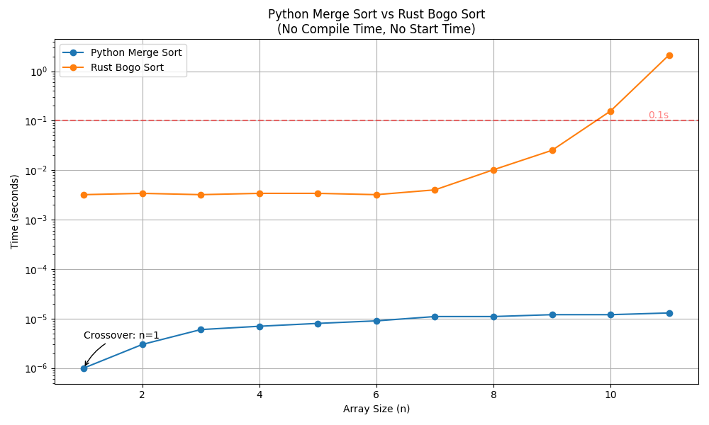
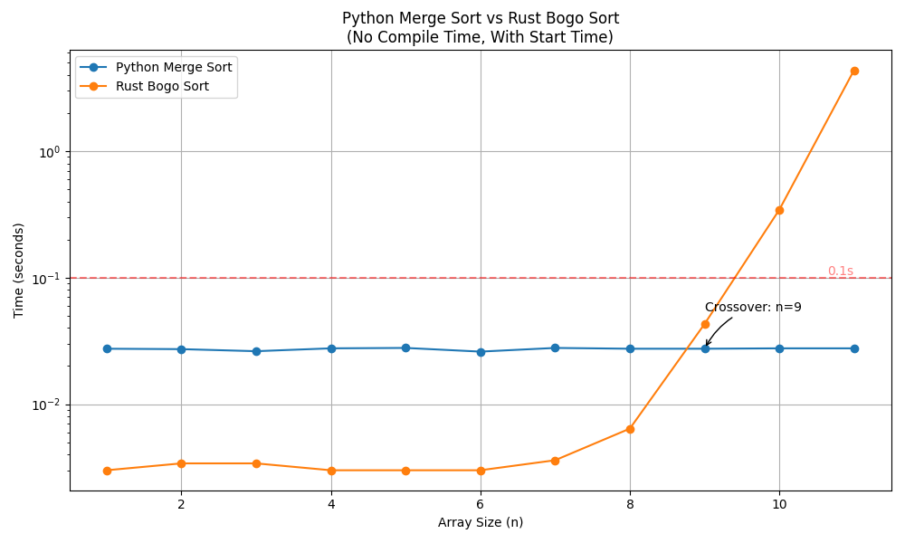

# Python Merge Sort vs Rust Bogo Sort Comparison

This project compares the performance of merge sort implemented in Python against bogo sort implemented in Rust. The goal is to find the array length at which Python's merge sort becomes faster than Rust's bogo sort.

## Setup

1. Clone the repository:
   ```bash
   git clone https://github.com/henri123lemoine/sorting-comparison.git
   cd sorting-comparison
   ```

## Running the Benchmark

To run the benchmark and find the crossover point:

```bash
./benchmark.sh
```

This script will test various array lengths and report the point at which Python's merge sort becomes faster than Rust's bogo sort.

## Plotting the Results

To plot the benchmark results:

```bash
uv run plot.py
```

## Project Structure

- `src/merge_sort.py`: Implementation of merge sort in Python
- `src/lib.rs`: Rust file containing the bogo sort implementation
- `benchmark.sh`: Bash script to run the benchmark and compare the algorithms
- `plot.py`: Python script to plot the benchmark results
- `pyproject.toml`: Python project configuration
- `Cargo.toml`: Rust project configuration

## Results

No start times nor compile times:



Crossover point: 1

Start times and no compile times:



Crossover point: ~9

No start times and compile times:


Crossover point: 1

Start times and compile times:


Crossover point: 1

## TODO

- Compare with [Slowsort](https://arpitbhayani.me/blogs/slowsort/).
- Clean up structure to make additional comparisons simple.

